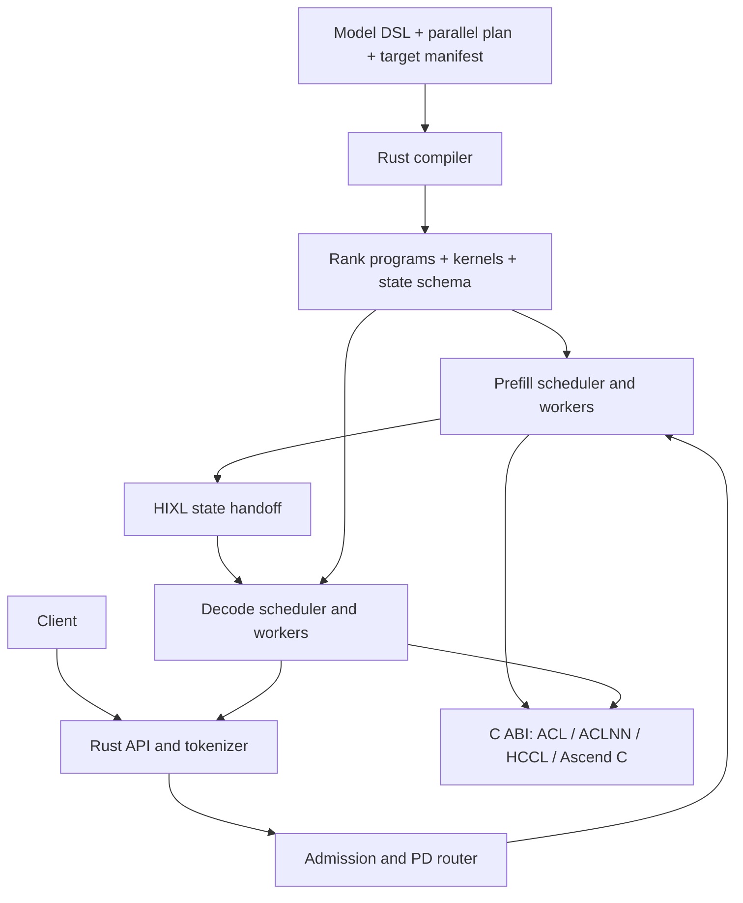

# InferFabric: an Ascend-native inference compiler and runtime

Status: target design, with partial implementation updates through 7 September 2026

Implementation update: native single-request Qwen3.5-2B text inference now runs through the vLLM 0.25.1 Rust frontend, with qualified ACLNN operators and full-model graph replay. See the [native milestone](npu-native-milestone.md) for validation and limits. The separate mock scheduler covers structural rank plans and PD ownership; native PD, continuous batching and distributed execution remain outstanding. The full design below is the target architecture.

## 1. Objective and success boundary

InferFabric experiments with an LLM inference engine written in Rust, using C++ only where CANN interfaces or Ascend C device kernels require it. Huawei Ascend is the only accelerator backend. Model architecture and parallelism are expressed in a typed DSL, then compiled into executable inference plans containing kernels, memory operations, synchronization, and communication primitives.

The first milestone is real end-to-end Qwen3.5-2B text generation: load the original checkpoint, tokenize a request, run chunked prefill on a prefill worker, transfer all continuation state to a separate decode worker, replay ACL Graph decode steps under continuous batching, and stream generated text. Full-attention layers use physically paged KV storage and page-table-aware attention. A readable answer alone is insufficient: numerical checks, state-transfer correctness, scheduling traces, and graph replay evidence are required.

Two acceptance levels prevent the small-model demo from obscuring the compiler objective:

- **E2E-1:** two separate Ascend devices, one prefill rank and one decode rank, implementing every serving feature above through DSL-generated plans.
- **Distributed-1:** the same model DSL compiled and tested with TP=2, TP=2 plus SP, and prefill CP=2. Communications must originate in compiler lowering, not model-specific handwritten rank code. At least one distributed configuration must complete PD generation. All advertised configurations require their own numerical tests.

Initial scope is the language-generation path of the Qwen3.5-2B checkpoint; image/video inputs, vision-encoder execution, speculative decoding, quantization, MoE, pipeline parallelism, and cross-generation device mixing are deferred. Text-only support must be stated in the server's capability response. No model substitutions or smaller architectural stand-ins count as E2E-1.

## 2. Constraints and evidence

Project-owned server, scheduler, tokenizer integration, checkpoint loading, DSL parser/compiler, benchmark driver, and tests use Rust. C++ provides a narrow ABI bridge and Ascend C kernels. No Python interpreter, PyTorch process, PyO3 embedding, or Python worker is part of startup or execution. Use prebuilt vendor libraries where possible; separately audit whether vendor build/install tools require Python. Such tooling must not become an inference dependency. Removing Python eliminates this engine's GIL exposure; it does not by itself establish a performance win. Measure host scheduling and kernel-launch costs.

The requested `/mnt/SATASSDEXT4/cann/mnt/SATASSDEXT4/cann` does not exist in this environment. The inspected source root is `/mnt/SATASSDEXT4/cann`. These are source capabilities, not proof of installed-driver or device compatibility. Observed revisions: runtime `681ef7610df13c8128982901142a2c869ddbb53e`; ops-transformer `e75072d7e7519405025d05a98cf1b2f106ad3874`.

Local findings materially affect the design:

| Evidence | Design consequence |
|---|---|
| ACL Graph records stream tasks and replays them through `aclmdlRIExecuteAsync`; capture does not execute them. [C1] | Warm up before capture, preserve all referenced allocations, and validate replay independently. |
| The chunked and recurrent gated-delta operators list A2/A3 and Ascend 950 support. [C2, C3] | Start with vendor kernels, subject to exact shape, dtype and numerical constraints. |
| The inspected causal-convolution operator lists Ascend 950 support and no A2/A3 support. [C4] | A2/A3 requires an Ascend C implementation or a validated alternative decomposition. |
| FusedInferAttentionScore V4 exposes paged block tables but sequence lengths as host `aclIntArray`; V4 lists A2/A3 support and excludes 950. [C5] | Do not assume changing a device length tensor changes a captured V4 task. Choose a version-specific adapter or custom graph-safe paged decode kernel. |
| HIXL supplies C++ registered-memory point-to-point transfer. [C6] | Use a small C ABI bridge for PD transport; transfer recurrent state as raw typed regions too. |

The exact Ascend SKU, number of devices, host architecture, network topology, firmware, CANN release, and kernel-library tags remain deployment inputs. Provisional development baseline is an A2/A3 system with two devices for E2E-1 and four or more for symmetric TP=2 PD. Do not claim all Ascend products are supported. Freeze a tested compatibility manifest before implementation benchmarks.

## 3. vLLM relationship

Use the experimental vLLM Rust frontend as a candidate source for API, request lifecycle, tokenization, streaming, and client infrastructure. It is not sufficient merely to put a Rust HTTP server in front of a Python inference engine. Evaluate the precise upstream revision and retain useful Rust modules behind an InferFabric engine interface; replace the engine-core connection with our Rust scheduler/runtime. Audit dependencies and preserve upstream license notices when reusing code.

Reproduce the relevant vLLM serving semantics: token-budgeted chunked prefill, iteration-level continuous batching, and block-managed attention state. Reusing its Python scheduler or Ascend Python execution backend is incompatible with the execution constraint. The implementation now pins the vLLM 0.25.1 Rust frontend and injects the InferFabric backend. The serving frontend must remain this Rust frontend; a separate gateway or Python engine is outside the user-approved scope. Upstream references and exact boundaries are recorded in the research note accompanying this document.

The upstream CLI explicitly starts a headless Python engine beside the Rust frontend. See the [CLI source](https://github.com/vllm-project/vllm/blob/main/rust/src/cmd/examples/README.md) and [experimental roadmap](https://github.com/vllm-project/vllm/issues/44280). The [research note](research.md) also records current upstream GDN disaggregation support; that support does not establish an Ascend or Python-free implementation.

## 4. Model contract: hybrid state is essential

The [pinned checkpoint configuration](https://huggingface.co/Qwen/Qwen3.5-2B/blob/bf4df5f05ef9c33020b38c73a676d85ad35d2c35/config.json), revision `bf4df5f05ef9c33020b38c73a676d85ad35d2c35`, gives the initial concrete model contract:

| Property | Value |
|---|---|
| Decoder | 24 layers: 18 gated-delta, 6 full attention; three linear then one full, repeated |
| Hidden / FFN intermediate | 2048 / 6144; dense FFN |
| Full attention | 8 query heads, 2 KV heads, head dimension 256; output gating |
| Linear attention | 16 key heads, 16 value heads, key/value dimension 128; convolution width 4 |
| Vocabulary | 248320; tied input/output embeddings |
| Precision / recurrence | BF16 checkpoint; FP32 recurrent state initially |
| Positional encoding | Partial RoPE fraction 0.25; theta 10000000 |
| Normalization | Epsilon 1e-6; preserve zero-centered RMSNorm semantics from the reference |

The [Transformers model source](https://github.com/huggingface/transformers/blob/main/src/transformers/models/qwen3_5/modular_qwen3_5.py) supplies mathematical implementation details; pin its revision when generating fixtures. A gated-norm primitive must preserve its own weight convention rather than inheriting the decoder norm convention indiscriminately.

Qwen3.5 uses a hybrid of full attention and gated-delta linear attention. Read the pinned checkpoint's configuration and weight map; do not interpret the model as a stack of ordinary Qwen3 attention layers. Validate the layer-type schedule, attention and linear-attention head counts, per-head dimensions, convolution width, RoPE settings, normalization conventions, gates, embedding/output tying, vocabulary, and checkpoint tensor names before allocation.

The model DSL explicitly describes:

- Token embedding, ordered decoder layers, final normalization, and language head.
- Full-attention blocks including Q/K normalization, positional encoding, attention gates, causal attention and output projection as required by the pinned implementation.
- Gated-delta blocks including projections, causal convolution, Q/K normalization, decay/beta transformations, the delta recurrence, gated normalization and output projection.
- Residual paths and gated feed-forward blocks with the checkpoint's exact ordering.

Two kinds of persistent state coexist:

| Layer type | Persistent per-request state | Lifetime |
|---|---|---|
| Full attention | K/V pages and logical page table | Grows with consumed tokens |
| Gated delta | Recurrent matrix and causal-convolution history | Fixed shape for a given layer, updated per token/chunk |

Store recurrent matrices in FP32 initially and activations/weights/KV in BF16 where supported. Match each operator's state orientation explicitly; a transpose is not implicit. For the local chunk GDR API, state layout is `[B, Nv, Dv, Dk]`. Its documented input ranges include `g` in `[-1,0]`; instrument the actual checkpoint's decay values and use a mathematically faithful fallback if the valid model domain exceeds the operator contract. Never clamp values merely to satisfy a kernel. [C2]

Scheduler chunks and a GDR kernel's internal chunks are different concepts. Every scheduler chunk must consume the preceding convolution/recurrent state and return the exact state at its end, including irregular final chunks. Resetting the recurrence at each chunk silently changes the model.

## 5. System architecture



Use one process per device rank initially. A group leader owns scheduling decisions; every rank executes the same step ID and collective order. Rust async tasks handle networking; a dedicated device thread owns its ACL context and submits work. Bounded channels isolate request traffic from device execution. The scheduler never holds a global lock while waiting for NPU completion.

A proposed Cargo workspace contains `inferfabric-dsl`, `inferfabric-ir`, `inferfabric-compiler`, `inferfabric-model`, `inferfabric-runtime`, `inferfabric-scheduler`, `inferfabric-transfer`, `inferfabric-server`, and `inferfabric-bench`. A `cann-sys` boundary holds checked bindings; `native/` holds the C++ bridge and Ascend C kernels. This is a proposed layout, not an implemented workspace.

## 6. DSL and compilation

The DSL is a standalone textual language parsed by Rust, not Python configuration or a wrapper around arbitrary model code. Separate mathematical architecture from placement and execution policy. The syntax below illustrates the proposed language; it is not currently executable:

```text
model Qwen35Text(config: Qwen35Config) {
  weights = safetensors(config.weight_schema);
  x = embedding(tokens, weights.embed);
  for i in 0..config.layers {
    n = rms_norm(x, weights[i].input_norm, config.norm_contract);
    y = match config.layer_types[i] {
      full_attention => qwen35_full_attention(n, kv[i], weights[i], config),
      linear_attention => qwen35_gated_delta(n, recurrent[i], conv[i], weights[i], config)
    };
    x = x + y;
    x = x + swiglu(rms_norm(x, weights[i].post_norm), weights[i].mlp);
  }
  logits = linear(rms_norm(x, weights.final_norm), weights.lm_head);
}

plan Demo for Qwen35Text {
  target = ascend(manifest = "hardware.lock");
  prefill.mesh = [tp: 1, cp: 1];
  decode.mesh = [tp: 1, cp: 1];
  state.full_attention = paged(block_tokens = 128);
  state.gated_delta = recurrent(dtype = fp32);
  prefill.schedule = chunked(token_budget = 2048);
  decode.schedule = continuous(batch_buckets = [1, 2, 4, 8, 16, 32]);
  decode.execution = acl_graph(required = true);
  handoff = registered_transfer(kv, recurrent, conv, continuation);
}

plan Distributed extends Demo {
  prefill.mesh = [tp: 2, cp: 2];
  decode.mesh = [tp: 2, cp: 1];
  shard linear.output_features over tp;
  shard mlp.intermediate_features over tp;
  sequence_parallel residual_norm over tp;
  context_parallel full_attention over cp using ring_exact;
  context_parallel gated_delta over cp using ordered_state_handoff;
}
```

Composite Qwen operators expand into typed primitive subgraphs before placement. They cannot conceal handwritten TP/CP communications. The block size and budgets above are starting candidates, validated against kernel constraints and device memory; unsupported values produce diagnostics.

Compilation stages:

1. Parse and resolve the pinned model config and typed weight schema. Reject unknown architecture fields affecting computation.
2. Produce a shape-typed model IR with symbolic batch/token dimensions, dtype, layout, state reads/writes, and explicit mathematical operations.
3. Expand composite operators and verify full token/state semantics for prefill and decode.
4. Apply placement: attach mesh axes and sharding to every value and persistent state object. Infer necessary reshard operations.
5. Lower reshard operations to explicit AllReduce, AllGather, ReduceScatter, point-to-point exchange or local copies. Assign communicator, sequence number, counts and dependencies.
6. Select compatible ACLNN or custom kernels using the locked target. Reject unsupported graph or numerical requirements.
7. Plan liveness, scratch reuse, KV/state pools, transfer buffers, and graph-stable allocations. Insert stream events and ownership barriers.
8. Emit per-rank execution programs, generated C++ launch code where needed, compiled Ascend C kernels, a state-transfer schema, and a readable execution trace.

Compilation runs at server startup, before serving requests. The Rust DSL compiler emits a binary per-rank execution plan and any required native device binaries. The plan is a typed instruction tape executed by the Rust runtime; it is not an entire model translated into C++. Existing compatible vendor kernels are linked/referenced, while custom kernels are specialized from Ascend C templates and compiled through the vendor toolchain. Triton-Ascend and TileLang-Ascend are not dependencies of this design.

This is a startup JIT: compile on a cache miss, or load a validated binary artifact on a cache hit. Artifact keys include DSL/config/weight hashes, template source hashes, compiler version and flags, mesh, dtype, bucket specifications, CANN/kernel versions and SoC. Write cache entries atomically and validate their compatibility before loading. Compilation failure prevents readiness; there is no Python compilation or execution fallback. Qualifying a vendor compiler invocation that satisfies the project's no-Python startup constraint is a hardware/toolchain gate.

### Startup compilation and readiness

The startup sequence is mandatory and completes before request admission:

1. Validate the model, parallelism plan, target manifest and complete supported batch/context bucket set.
2. Compile the DSL to per-rank binary plans and compile missing Ascend C specializations, or load matching cached artifacts.
3. Load weights and kernel binaries; allocate stable KV/state/metadata/workspace buffers; establish streams, communicators and PD transport resources.
4. Warm up each required specialization outside capture, using disposable request state.
5. Capture every configured decode bucket with ACL Graph, then replay each graph with validation inputs. Reset validation state before admitting real requests.
6. Mark a worker group ready only after all its ranks pass validation. Enable PD request admission only when the required prefill and decode groups and their transfer path are ready.

“Graph compilation” here means startup ACL Graph capture and runtime preparation of the compiled execution program. It is distinct from native kernel compilation. Captured graph handles are process-local runtime objects and must be recreated on each process start, even when compiled binaries come from cache. Prefill plans are compiled at startup too; prefill graph capture is optional in the first demo.

No kernel compilation or first-use graph capture occurs in the serving path. Dynamic values such as token positions, sequence lengths and page tables remain runtime metadata. Requests exceeding the configured supported capacities receive an explicit capacity error; they do not trigger compilation. Changing model, mesh or bucket configuration requires preparing and validating a new worker instance before routing requests to it. Record compilation/cache-load, warmup, capture and validation times separately as startup metrics.

IR state effects use versioned handles: `read(state@t)` and `write(state@t+1)`. Communication tokens and stream events are dependencies in the same graph. Verify no state has simultaneous writers, no rank skips a required collective, no read precedes its producer/receive, and padded rows cannot mutate live state. Emit compile-time diagnostics for non-divisible shards, unsupported GQA layouts, incompatible PD schemas and graph-unsafe operators.

## 7. Parallelism and communication lowering

### Tensor parallelism

The September 7 native baseline now supports output-row sharding with an AllGather after every linear projection; attention/state remain replicated. See [qualified implementation](npu-tensor-parallel.md). The paragraph below describes the subsequent optimized layout target.

Use column-sharded Q/K/V and MLP up/gate projections, followed by row-sharded attention output and MLP down projections. Reduce partial row-projection outputs with AllReduce, or ReduceScatter when the consumer is sequence-sharded. Shard linear-attention channels/heads and their recurrence and convolution state consistently. Grouped heads require compatible Q/K/value grouping; initially reject TP sizes that cannot preserve this relation rather than silently changing it. Replicated small tensors must be declared.

For vocabulary projection, initially gather sharded logits to a sampling rank and broadcast the selected token. This costs bandwidth but gives simple, testable greedy semantics. Distributed top-k/sampling can follow. HCCL provides the relevant standard collectives; exact capture compatibility is a target qualification item. [C7]

### Sequence parallelism (SP)

SP partitions activation tokens across the TP group for residual, normalization and eligible pointwise work. It does not independently partition the request's attention context. A typical compiler-generated transition is row-parallel output → ReduceScatter(tokens) → residual/norm → AllGather(tokens) → column-parallel projection. Ensure residual tensors use the same layout and pad uneven token shards safely.

SP is most useful in prefill. A single decode token offers no useful sequence split; the plan may disable SP for decode and must report that explicitly. Do not advertise a no-op SP annotation as tested support.

### Context parallelism (CP)

CP splits a request's ordered context across a separate mesh axis. For full attention, use an exact causal ring traversal of KV shards for prefill. Each query shard combines local attention results with stable online softmax statistics: global max, rescaled exponential sum, and weighted numerator. Apply causal masking using global token positions. Local softmax outputs cannot simply be summed.

Gated-delta CP needs recurrence semantics. The first implementation uses ordered state handoff: the earliest shard begins with incoming state, computes its local segment, and sends its final recurrent matrix and convolution history to the next shard. The final state belongs to the last shard. This is correct but serial along that recurrence; report the limitation and measure it. A later optimization can derive associative affine state transformations and a parallel prefix scan, including convolution boundary handling. It is not a free AllReduce and is not required for the first implementation.

For PD with prefill CP>1 and decode CP=1, gather/scatter full-attention pages into the destination TP layout and transfer each linear layer's final state from its final context owner. Initial TP widths match across P and D; differing TP widths are rejected until explicit resharding is implemented. Decode CP>1 is a later extension: query broadcast and exact reduction of partial softmax statistics for full attention, with a declared ownership strategy for recurrence. It is not part of the initial support claim.

Compiler verification includes two-rank communication traces and numerical equivalence, not just successful communicator creation. TP/SP/CP may slow a 2B model; correctness and compiler expressiveness are the first reasons to implement them.

## 8. Continuous batching, chunked prefill and memory

Each scheduler step carries a monotonically increasing epoch, ordered request/slot list, token positions, per-request chunk lengths, page mappings and state-slot mappings. Workers acknowledge completion before the scheduler commits state advancement. New requests enter and completed requests leave at iteration boundaries.

Prefill maintains a token budget across requests, slices long prompts, and interleaves chunks fairly. A request receives its next chunk only after its previous state update completes. Ragged kernels must respect request boundaries, including convolution histories. A GDR chunk kernel's internal padding must not advance logical state for padded tokens.

Decode admits transferred requests only when enough KV pages and recurrent slots are reserved. It processes one token per live request per iteration, selects a batch bucket, fills metadata, executes the graph and samples. Admission reserves the next KV block before a page boundary. Capacity pressure queues new work; the first version does not evict an active recurrence and pretend KV-only recomputation is sufficient.

Paged attention means K/V are allocated from fixed-size pools and attention reads them via logical block tables, including noncontiguous physical pages. Contiguously materializing all KV on every step does not satisfy the final paged-attention requirement. Page allocation, reference counts, tail-block ownership and deferred reclamation live in Rust. Prefix reuse is deferred because hybrid prefix reuse needs matching recurrent snapshots as well as KV.

For each rank budget:

`HBM = weights + KV_pool + recurrent_pool + conv_pool + activations + graph_workspaces + transfer_staging + runtime_reserve`.

For unsharded BF16 full-attention state, KV bytes per request are `2 × full_layers × ceil(T/block_tokens) × block_tokens × kv_heads × head_dim × 2`. FP32 recurrent state bytes are `linear_layers × value_heads × value_dim × key_dim × 4`, plus the convolution cache. Apply actual head ownership and any replication when sizing rank-local pools. Do not divide all state blindly by TP×CP. Graph buckets share scratch only when executions cannot overlap. Publish planned and measured high-water memory.

## 9. Prefill/decode disaggregation protocol

P and D use separate processes, device allocations and role schedulers even on one host. Prefer HIXL C++ registered-memory transfers through the bridge. Host-staged copies are useful for bring-up and diagnosis, but the final transport report identifies the actual data path. Do not assume HIXL completion implies arbitrary ACL stream visibility without the documented synchronization sequence. [C6]

Define the token boundary precisely: after P consumes prompt tokens `x[0..L)`, it samples the first output token `y0` from the final prompt logits. It transfers state representing exactly those L consumed tokens, plus `y0` as the next decode input. D consumes `y0` at position L and produces `y1`. Never process the final prompt token twice or count `y0` as already present in KV. EOS at `y0` completes without another decode step.

Protocol:

1. Router assigns request ID, attempt epoch and destination group. D reserves pages and state slots and returns a lease plus logical-region destinations.
2. P computes chunks; final completion establishes a coherent snapshot of every full-attention page, every recurrence, and convolution history.
3. P sends a manifest: model/weight/plan/state-schema hashes, consumed length, per-layer region dtype/shape/layout/shard, valid tail length, next token, sampler seed/counter, and transfer IDs. No foreign device pointers become local pointers.
4. Transfer all regions into reserved D buffers. D validates lengths and ownership, waits for transport completion and establishes device visibility. All D ranks must be ready.
5. D atomically commits the request to its runnable set and acknowledges the handoff epoch. Only then does P release source state and the router release the first token to the client.
6. Timeout/cancellation aborts the lease; reclaim allocations only after pending transfers and kernels are fenced. Duplicate manifests/ACKs are idempotent; late completions with stale epochs cannot activate reused slots.

Use a reliable control connection for manifest/ACK traffic; HCCL collectives serve intra-role parallel execution. Never place P and D schedulers in one collective communicator. For the first version, worker failure terminates affected requests with an explicit error and cleans up; seamless mid-generation recovery is deferred.

## 10. ACL Graph decode

ACL Graph is mandatory for normal decode in the accepted demo. Keep an eager path for differential testing, but a fallback must be reported and does not count as graph acceptance.

At worker initialization, load weights, reserve KV/state arenas, create streams and communicators, select batch/context-capacity buckets, and prepare compatible kernel launch metadata and workspaces. Warm up outside capture using disposable state. Capture one model step per bucket with `aclmdlRICaptureBegin`, enqueue the generated program, end with `aclmdlRICaptureEnd`, and replay with `aclmdlRIExecuteAsync`. Destroy graph instances before releasing referenced resources. Capture must contain no prohibited stream/event/device/context synchronization or queries; host buffers used in captured copies must be ACL-pinned. [C1]

Stable addresses alone are insufficient. Each kernel adapter declares which arguments are device-read values and which are frozen host attributes/tiling decisions. Runtime token IDs, positions, valid lengths, page tables, live masks and state indices must be read from stable device metadata or updated using a verified task-update mechanism. In particular, the inspected FIA V4 host sequence-length arrays cannot be treated as mutable device metadata. [C5]

Preferred first graph-safe attention path: a custom Ascend C paged decode kernel reading lengths and block tables from device buffers, specialized for the model's verified head geometry. Alternatively qualify a vendor API/task-update path against the exact release, proving changed lengths and page mappings across replays. Recapturing each token is not acceptable. Context-capacity buckets limit static tables and kernel work without requiring a graph for every length.

For recurrent state, gather live request slots into fixed graph scratch, run the recurrence, and scatter updates only for live rows if the vendor kernel lacks safe indirection. Padded rows use separate valid dummy storage and cannot alias live KV or recurrence. Prevent overlapping replays on shared state/workspace. Stage the next metadata copy only when the previous replay no longer reads that buffer; start with a single in-flight iteration per worker.

TP collectives must have identical fixed shapes and order on every rank in a selected bucket. First qualify collective capture in a small probe. If unavailable, segmented graphs around eager communications are a documented intermediate step; they do not satisfy a claim of fully captured TP decode. E2E-1 can establish full graph decode at TP=1 while this is resolved.

Sampling may initially run in Rust on copied final logits; report its transfer and latency cost separately. The forward pass remains captured. Later move greedy/top-k selection onto the NPU to avoid vocabulary-sized copies.

## 11. CANN integration and kernel work

The C ABI exposes opaque handles, fixed-width POD descriptors, explicit buffer sizes, status codes and error text. No C++ STL objects or exceptions cross it. Rust wrappers own device allocations, streams, graphs and registration leases; destruction waits for outstanding work. Keep `unsafe` confined to checked FFI modules.

Use ACL for device/context/memory/events, ACLNN for suitable operators, HCCL for collectives and HIXL for PD data. Start from C++ examples in the inspected repositories. For ACLNN's workspace-query/execute pattern, prepare descriptors and persistent workspace per supported shape; executor lifetime and replay behavior must follow the pinned API, not an assumed reusable-executor convention. [C1–C6]

Prioritized custom kernels are graph-safe paged decode attention, A2/A3 causal convolution with update state, metadata packing and masked state gather/scatter. Use vendor matmul, normalization and GDR implementations when qualified. Fuse projections or pointwise operations only after a correct unfused baseline exists. Ascend C host tiling and device code must target the selected SoC; source availability for another product is not portability proof.

## 12. Validation and deliverables

All tests and load generators are Rust or C++. Use pinned externally produced reference tensors as optional fixtures; no Python reference process is required. Establish an independent straightforward Rust/C++ mathematical reference for tiny operator shapes, then compare the full model against checkpoint-owner-compatible golden logits/tokens with provenance. If full-model goldens are unavailable, report that gap rather than claiming semantic equivalence from self-comparison.

| Gate | Required evidence |
|---|---|
| Hardware qualification | Version manifest; BF16 matmul, GDR and convolution tests; two-device transfer; graph metadata mutation; HCCL capture result |
| Compiler | Deterministic artifacts; illegal-plan rejection; generated collective trace; model runs via generated rank programs |
| Model correctness | Layer/intermediate comparisons; full prefill vs irregular chunking; eager vs graph logits; no NaN/Inf; pinned tokenizer/template fixtures |
| Paged attention | Noncontiguous pages; tail/page boundaries; multi-request isolation; allocation and reclamation under churn |
| PD | Local continuation vs transferred continuation, including all hybrid state; multi-rank readiness; duplicate/stale handoff and cancellation tests |
| Scheduling | New requests join before older ones finish; long prompts split and interleave; budget/memory bounds; no starvation or double token consumption |
| Graph | All configured buckets captured and validated before readiness; replay counters and device trace; changed tokens/lengths/pages and reused request slots; bucket transitions; zero serving-path compilation/capture or hidden eager decode fallbacks |
| Parallelism | TP=2, TP+SP and CP=2 compared with unsharded execution; communication derived from DSL; at least one distributed PD E2E run |

Before testing, fix numerical thresholds per dtype/operator against the independent reference. Proposed initial BF16 full-model screening: normalized logit RMSE ≤1e-2 and cosine similarity ≥0.999, subject to calibration documented before acceptance; these are design targets, not observed accuracy. Require exact greedy matches on a selected stable-margin fixture set and investigate near-tie divergences with logits, rather than requiring universal bitwise identity across reduction orders. Recurrent-state drift needs long-sequence tests, not only a single step.

Initial workload grid: prompt lengths 32, 512, 2048 and 8192; generation lengths 32 and 128; concurrency 1, 4, 16 and 32 within declared memory capacity. Add exact page/chunk boundaries and boundary±1, random chunk partitions, cancellation, EOS, Unicode/tokenization and slot reuse. The first supported context limit may be 8192 even if the checkpoint advertises more; document and enforce it.

Record TTFT including PD handoff, inter-token latency p50/p95/p99, output tokens/s, request throughput, scheduler CPU time, submission overhead, graph hit rate, transfer bytes/time, HBM high-water mark and errors. Compare eager vs graph and colocated vs PD with identical precision, requests and hardware accounting. A 2B model may make PD slower because transfer dominates; publish the result. Functional acceptance has no invented speedup requirement.

## 13. Implementation sequence

1. **Freeze contracts:** choose hardware/software revisions, inspect the checkpoint and tokenizer, define exact architecture/state schemas, run capability probes. Resolve the graph metadata path and convolution support first.
2. **Vertical compiler slice:** parse the DSL, generate a single-rank BF16 eager program, load safetensors in Rust, and complete text generation. Use real hybrid layers from the start.
3. **State and scheduling:** implement paged KV, recurrent slots, chunked prefill, continuous batching and resource accounting. Validate chunk invariance and inter-request isolation.
4. **Graph decode:** stable pools, metadata adapters, bucket capture/replay, graph-safe attention, masked state updates. Validate every graph mutation case.
5. **PD E2E-1:** implement lease/manifest/transfer/ACK, move full hybrid state, stream text, collect the complete acceptance bundle.
6. **Distributed-1:** derive TP collectives, SP layout transitions, exact full-attention CP and ordered recurrent CP from the DSL; integrate CP-to-decode state redistribution and distributed PD.
7. **Optimize from profiles:** fuse kernels, improve sampling, tune chunk/batch/page sizes, overlap transfer where ownership permits, and consider recurrent prefix-scan CP.

A milestone is complete only with saved commands, artifact hashes, logs and test results. This design document does not assert that hardware probes, kernels or model execution have already succeeded.

## 14. Open decisions and failure risks

The highest-risk items are graph-safe dynamic attention metadata, exact Qwen hybrid semantics, CANN operator coverage on the chosen SKU, and recurrence-correct CP. They receive early executable probes. Secondary risks are FFI resource lifetime, graph workspace multiplication, collective deadlocks and transport completion races. Address them through typed state ownership, bounded resources and failure tests.

Before coding, supply the actual Ascend inventory and accessible model checkpoint location. Defaults above allow design work to proceed, but implementation cannot select a trustworthy kernel manifest from the word “Ascend” alone. Confirm whether the eventual demo must include image inputs; this draft intentionally defines the first acceptance target as text generation.

## 15. Primary local references

- **[C1]** [ACL Graph single-stream guide](/mnt/SATASSDEXT4/cann/runtime/docs/zh/dev_guide/04-01_single_stream_capture.md), [runtime API header](/mnt/SATASSDEXT4/cann/runtime/include/external/acl/acl_rt.h), and [task update guide](/mnt/SATASSDEXT4/cann/runtime/docs/zh/dev_guide/04-03_task_update.md).
- **[C2]** [ChunkGatedDeltaRule contract](/mnt/SATASSDEXT4/cann/ops-transformer/attention/chunk_gated_delta_rule/README.md).
- **[C3]** [RecurrentGatedDeltaRule contract](/mnt/SATASSDEXT4/cann/ops-transformer/attention/recurrent_gated_delta_rule/README.md).
- **[C4]** [CausalConv1d support and state contract](/mnt/SATASSDEXT4/cann/ops-transformer/mamba/causal_conv1d/README.md).
- **[C5]** [FusedInferAttentionScore V4 API](/mnt/SATASSDEXT4/cann/ops-transformer/attention/fused_infer_attention_score/docs/aclnnFusedInferAttentionScoreV4.md) and [operator overview](/mnt/SATASSDEXT4/cann/ops-transformer/attention/fused_infer_attention_score/README.md).
- **[C6]** [HIXL overview](/mnt/SATASSDEXT4/cann/hixl/README.md) and [C++ interface](/mnt/SATASSDEXT4/cann/hixl/include/hixl/hixl.h).
- **[C7]** [Huawei HCCL communication primitives](https://www.hiascend.com/doc_center/source/zh/canncommercial/80RC3/developmentguide/hccl/hcclug/hcclug_000004.html). This reference establishes primitive semantics, not capture compatibility for a selected release.

Local absolute links identify the inspected checkout. The implementation should retain revision-pinned upstream links and a compatibility manifest for portability.
